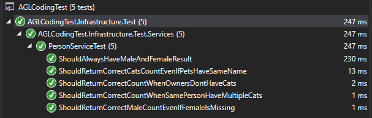
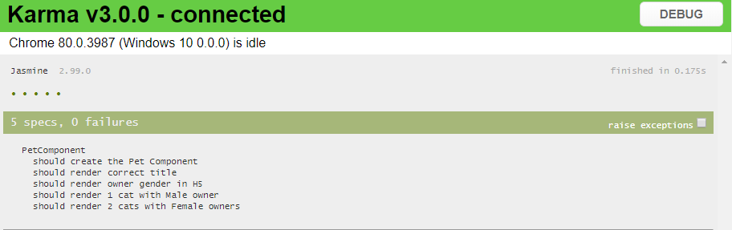

# CodingTest
AGL coding test

Get more details on requirements from http://agl-developer-test.azurewebsites.net/

## Prerequisites ##

* [.NET Core (v2.2)](https://dotnet.microsoft.com/download/dotnet-core/2.2)
* [Visual Studio 2017 (v15.9.13)](https://www.visualstudio.com/)

## Implementation ##

## Tools and Technology used ##

* Angular 6
* Jasmine tests
* .NET Core Web API
* NUnit tests
* Mocks using Moq

## Running the application ##

* Clone the repository to your local machine
* Open AGLCodingTest.sln in Visual Studio
* Set AGLCodingTest.WebUI as the start-up project 
* Build and run the application. First run will take time as all nuget and npm dependencies has to be downloaded
* After successful build, you should be able to access the application using [http://localhost:59750/](http://localhost:59750/)

###API###

Some valid service urls :

* [http://localhost:59750/api/person/pet/cat](http://localhost:59750/api/person/pet/cat)
* [http://localhost:59750/api/person/pet/dog](http://localhost:59750/api/person/pet/dog)
* [http://localhost:59750/api/person/pet/fish](http://localhost:59750/api/person/pet/fish)

###Tests###

* To run UI tests Run `ng test` 

## Further improvements ##

* Should be able to perform more testing. Eg: Add integration tests using same technology stack.
* Can be changed to use CQRS pattern by changing service layer to accept commands. Create command/query objects in the applciation layer.